# yuwell鱼跃

臂式电子血压计 语音Electronic Blood Pressure Monitor规格型号：YE660C

# 产品使用及技术说明书

使用前请详细阅读说明书!生产日期见合格证或包装臂式电子血压计（以下简称血压计）

# 只有正确的测量方法，才能得到准确的数值

# 一、正确的佩带方式

⚫ 按图示将臂带戴在手臂上。  
⚫能够测量的手臂周长范围为22厘米\~32厘米。

# 二、正确的测量坐姿

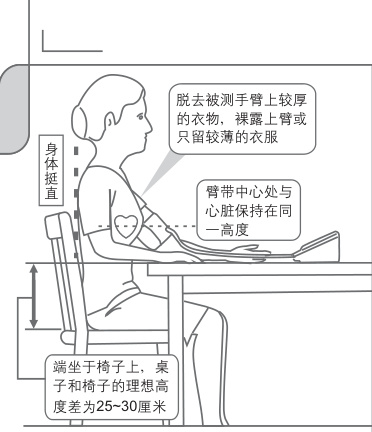

●按图示测量前静坐5分钟。  
• 臂带中心处与心脏保持在同一高度。  
●脱去被测手臂上较厚的衣物，裸露上臂或只留较薄的衣服。  
•端坐于椅子上，桌子和椅子的理想高度差为25厘米\~30厘米。  
⚫身体挺直。

# 三、开始测量

●按下[开/关]按钮，即可开始测量。  
● 测量中请不要说话和移动身体。  
●饭后、运动后、情绪激动等情况下不宜测量(详见说明书)。

1、安全注意事项· ·01  
2、产品保证书 .08  
3、使用范围及注意事项 .09  
4、产品特点及技术参数· .10  
5、产品结构及说明 12  
6、产品操作说明… 14  
7、血压测量方法指导 .15  
8、相关功能使用. 20  
9、血压测量常见疑问与解答. 26  
10、常见故障及排除 .30  
11、保养与维护事项 32  
12、健康日记… 33

此处所示警告与注意，用于正确安全使用产品，并防止对用户和他人造成危害或带来损害。

警告与注意内容如下：

<html><body><table><tr><td>图例</td><td>内容</td></tr><tr><td>警告</td><td>表示错误使用时，有可能发生人员伤亡</td></tr><tr><td>注意</td><td>表示错误使用时，有可能发生人员伤害或物品损坏</td></tr><tr><td></td><td>记号是表示禁止(不允许的事情) 具体禁止内容在中或者附近用文字或图画表示， 左图示表示“一般的禁止”</td></tr><tr><td>0</td><td>● 表示强制(必须遵守的事情) 具体强制内容在●中或者附近用文字或图画表示， 左图示表示“一般的强制”</td></tr><tr><td></td><td>电子信息产品污染控制标志 本产品自使用之日起，环保使用期限为10年， 易耗品不包含在内。</td></tr><tr><td></td><td>符号含义是BF型应用部分</td></tr><tr><td></td><td>注意！查阅随机文件</td></tr><tr><td></td><td>向上</td></tr><tr><td></td><td>易碎物品</td></tr><tr><td></td><td>怕雨</td></tr></table></body></html>

<html><body><table><tr><td colspan="2"></td><td colspan="6">有毒有害物质及其化合物或元素</td></tr><tr><td colspan="2">部件名称</td><td>铅及其 化合物 ≤1000PPM≤1000PPM</td><td>汞及其 化合物</td><td>镉及其 化合物 ≤100PPM</td><td>六价铬及其 化合物 ≤1000PPM</td><td>多溴联苯 ≤1000PPM</td><td>多溴二苯醚 ≤1000PPM</td></tr><tr><td colspan="2">塑料外壳</td><td>O</td><td>O</td><td>O</td><td>O</td><td>O</td><td>O</td></tr><tr><td colspan="2">内部线缆</td><td>O</td><td>O</td><td>O</td><td>O</td><td>O</td><td>O</td></tr><tr><td colspan="2">线路板(含LCD)</td><td>O</td><td>O</td><td>O</td><td>O</td><td>O</td><td>O</td></tr><tr><td colspan="2">袖带</td><td>O</td><td>O</td><td>O</td><td>O</td><td>O</td><td>O</td></tr><tr><td colspan="2">电源适配器*</td><td>O</td><td>O</td><td>O</td><td>O</td><td>O</td><td>O</td></tr><tr><td colspan="2">电池*</td><td>O</td><td>O</td><td>O</td><td>O</td><td></td><td>O</td></tr><tr><td colspan="2">包材</td><td>O</td><td>O</td><td>O</td><td>O</td><td>O</td><td>O</td></tr><tr><td colspan="10">：表示该有毒有害物质在该部件所有均质材料中的含量均在GB/T26572-2011标准规定的 限量要求以下。 ×：表示该有毒有害物质至少在该部件的某一均质材料中的含量超出GB/T26572-2011标准 旻规定的限量要求。 *：表示该部件可能不是产品组成部件，以说明书中包装清单为准。 注：钢材中含铅≤3500PPM，铝材中含铅≤4000PPM，铜材中含铅≤4%; 所有包装类六种有毒有害物质含量均≤100PPM。</td></tr></table></body></html>

# 电磁兼容说明

本产品符合安全使用医用电气设备要求的EMC(电磁兼容性)标准和YY0505-2012。EMC标准是为了安全使用医用电气设备而定制的标准，该标准规定应将设备产生的电磁波对其他设备的干扰、以及其他设备(手机等)发出的电磁波干扰控制在一定的范围内。YY0505-2012(5.2.1.1项)中规定了需要使用者提供设备安全运行的EMC环境相关的详细信息，下面是对EMC相关技术说明的描述。(详情请参照YY0505-2012)

本产品在此EMC技术资料中所定的电磁环境工作时，其适用范围所述基本性能不受其影响。

# EMC(电磁兼容性）的定义

EMC(电磁兼容性)是指满足以下两方面要求的能力。

1、不会对附近的其他电子设备发出容许之外的电磁干扰声。(辐射)2、设备在有其他电子设备发出噪声等的干扰的电磁环境中能正常发挥其功能。(抗扰度)

# EMC(电磁兼容性)相关技术说明

医用电气设备需要有关EMC的专门指示，应根据以下描述的EMC信息进行使用。

1、本产品需要有关电磁兼容性(EMC)的专门提示。请根据本手册描述的EMC信息进行使用。  
2、便携式和无线射频(射频)通信设备可能影响本产品。  
3、请勿将本产品与其他设备相邻或叠放使用。(通信时除外)  
4、不可使用除专用附件以外的产品。否则可能导致辐射增加，抗扰度降低。

表1：准则及制造商声明一电磁发射一  

<html><body><table><tr><td colspan="3">准则及制造商声明-电磁发射</td></tr><tr><td colspan="3">本产品及专用AC电源适配器应在以下规定的电磁环境中使用。</td></tr><tr><td>发射试验</td><td>符合性</td><td>电磁环境-指南</td></tr><tr><td>射频发射 GB 4824</td><td>1组</td><td rowspan="2">本产品及专用AC电源适配器仅其内部功 能使用射频能量。因此，该射频发射很 低，对周围的电子器械造成干扰的可能 性较小。</td></tr><tr><td>射频发射 GB 4824</td><td>B类</td></tr><tr><td>谐波发射 GB 17625.1</td><td>A类</td><td rowspan="2">本产品及专用AC电源适配器适用于包括 下述设施在内的所有设施。是指直接连 接到为家庭用设施及用于家庭目的的建 筑物供应电力的公共低压电网的设施。</td></tr><tr><td>电压波动/闪烁发射 GB 17625.2</td><td>适用</td></tr></table></body></html>

表2：准则及制造商声明一电磁抗扰度一  

<html><body><table><tr><td colspan="4">准则及制造商声明-电磁抗扰度</td></tr><tr><td colspan="4">本产品及专用AC电源适配器的购买者或使用者应在该环境下使用。</td></tr><tr><td>抗扰度试验</td><td>IEC60601 试验电平</td><td>符合电平</td><td>电磁环境-指南</td></tr><tr><td>静电放电 GB/T 17626.2</td><td>±6kV接触放电 ±8kV空气放电</td><td>±6kV接触放电 ±8kV空气放电</td><td>地面应是木制、混凝土或 瓷砖，如果地面用合成材 料覆盖，则相对湿度至少 为30%</td></tr><tr><td>电快速瞬变 脉冲群 GB/T 17626.4</td><td>±2kV对电源线 ±1kV对输入/ 输出线</td><td>±2kV对电源线 不适用</td><td>网电源应具有典型的商业 或医院环境中使用的质量</td></tr><tr><td>浪涌 GB/T 17626.5</td><td>±1 kV线对线 ±2 kV线对地 <5%Ur，持续</td><td>± 1 kV线对线 不适用 <5%Ur，持续</td><td>网电源应具有典型的商业 或医院环境中使用的质量</td></tr><tr><td>电源输入线上 电压暂降、 短时中断和 电压变动化 GB/T 17626.11</td><td>0.5周期(在U上， >95%的暂降) 40%U，持续 5周期(在U上， 60%的暂降) 70%Uτ，持续 25周期(在Uq上， 30%的暂降) <5%U，持续 5秒(在Ur上， >95%的暂降)</td><td>0.5周期(在U上， >95%的暂降) 40%Ur，持续 5周期(在U上， 60%的暂降) <5%U，持续 25周期(在U上， 30%的暂降) <5%U，持续 5秒(在Ur上， >95%的暂降)</td><td>网电源应具有典型的商业 或医院环境中使用的质量。 如果本产品及专用AC电源 适配器的使用者在电源中 断期间需要连续运行，则 推荐使用电池</td></tr><tr><td>工频磁场 (50/60 Hz) GB/T 17626.8</td><td>3A/m</td><td>3A/m</td><td>工频磁场在典型的商业或 医院环境中应具有与一般 场所相同水平的特性</td></tr></table></body></html>

备注： $\mathsf { U } _ { \intercal }$ 是指施加试验电压前的交流网电压。

表3：准则及制造商声明一电磁抗扰度一  

<html><body><table><tr><td colspan="4">准则及制造商声明一电磁抗扰度</td></tr><tr><td colspan="4">本产品及专用AC电源适配器应在以下规定的电磁环境下使用。</td></tr><tr><td>抗扰度试验</td><td>IEC60601试验电平符合电平</td><td></td><td>电磁环境一指南</td></tr><tr><td>射频传导 GB/T 17626.6</td><td>3V(有效值) 150kHz ~80MHz</td><td>3V(有效值)品的所有部位。</td><td>不应在利用通过与发射机频率相 对应的方程式计算出的推荐间隔 距离以内使用便携式与移动式 RF通信设备，此间隔距离针本产 推荐间隔距离 d=1.2√ d=1.2√P 80 MHz ~ 800 MHz d=2.3 √P 800 MHz ~ 2.5 GHz 其中，P为发射机制造商所规定的</td></tr><tr><td>射频辐射 GB/T 17626.3</td><td>3V/m 80MHz ~2.5GHz</td><td>3V/m</td><td>发射机最大额定输出功率，以瓦 特(W)为单位，d为推荐间隔距 离，以米(m)为单位。 固定式射频发射机的电场强度通 过对电磁场的现场勘查a)来确 定，在每个频段范围都应比合规 性等级低。 在标有下述记号的设 (•)) 备附近有可能发生干扰。</td></tr><tr><td colspan="4">备注1：在80MHz与800MHz的环境下，间隔距离应用高频范围。 备注2：这些准则并非适用于所有状况。因为电磁波的传播还受建筑物、物体、人 体吸收与反射的影响。</td></tr><tr><td colspan="4">a)例如无线电话基站(手机/无线)、陆地移动无线电、业余无线电、AM/FM广播、 电视台之类的固定发射机产生的电场强度，就无法从理论上正确推算。 为了判断固定射频发射机产生的电磁环境，应考虑进行电磁场的现场勘测。在使 用本产品及专用AC电源适配器的场所测得的电场强度超过上述应用的射频合规 性等级时，应实行现场监控，以便验证本产品及专用AC电源适配器是否正常工 作。如有异常，应采取额外措施重新对本产品及专用AC电源适配器的朝向或位 置进行更改。 b)频率范围为在150kHz~80MHz，电磁强度为过3V/m以下。</td></tr></table></body></html>

# 表4：一便携式和移动式射频通信设备与设备过本产品之间的推荐间隔距离一

<html><body><table><tr><td colspan="4">便携式和移动式射频通信设备与设备或本产品及专用AC电源适配器之间的推 荐间隔距离。</td></tr><tr><td colspan="4">本产品及专用AC电源适配器应在对辐射射频干扰进行管理的电磁环境内使 用。本产品及专用AC电源适配器的购买者或使用者应根据通信设备的最大输 出功率，保持以下推荐的便携式和移动式射频通信设备(发射机)与本产品及专 用AC电源适配器之间的最小距离，以抑制电磁干扰。</td></tr><tr><td rowspan="2">发射机的最大额定 输出功率(W)</td><td colspan="3">基于发射机频率的 间隔距离(m)</td></tr><tr><td>150kHz~80MHz d=1.2 √P</td><td>80MHz ~ 800MHz d=1.2 √P</td><td>800MHz ~ 2.5GHz d=2.3√P</td></tr><tr><td>0.01</td><td>0.12</td><td>0.12</td><td>0.23</td></tr><tr><td>0.1</td><td>0.38</td><td>0.38</td><td>0.73</td></tr><tr><td>1</td><td>1.2</td><td>1.2</td><td>2.3</td></tr><tr><td>10</td><td>3.8</td><td>3.8</td><td>7.3</td></tr><tr><td>100</td><td>12</td><td>12</td><td>23</td></tr><tr><td colspan="4">关于最大额定输出功率不在上述列表内的发射机，用米(m)表示的推荐间隔 距离d可通过与发射机频率相对应的方程式计算出来。方程式中，P为用发射 机制造商所规定瓦数(W)表示的最大额定输出功率。 备注1：在80MHz与800MHz的环境下，间隔距离应用高频带宽度范围。 备注2：这些准则并非适用于所有状况。因为电磁辐射还受建筑物、物体、人 体吸收与反射的影响。</td></tr></table></body></html>

$\blacktriangleright$ 本产品自售出之日起，一星期内出现非人为因素的质量问题，本公司负责包退、包换、保修；在正常使用和保管情况下，本产品三年内出现质量问题，用户凭购物发票和保修卡给予免费维修，易耗易损件(包括臂带、气管、气接头、按钮、面板、电池)除外。三年以外的修理服务，将合理收费。

对下列因使用者个人原因而造成的故障或损坏将不提供免费维修服务：

1、擅自拆装、修理、改装本产品而造成的故障。

2、不正确的操作使用而造成的故障。

3、因不慎跌落而造成的损坏。

4、因不合理的保养而造成的故障。

5、因电池的泄漏而造成的腐蚀损坏。

6、因非鱼跃授权的维修点的不当修理而造成的故障等。

在进行保修服务时，如需要提供电路图、所必须的材料及电气线路的检修有疑难问题，请与制造商联系。

# 一、使用范围

▶本产品供测量人体血压和脉搏用(12周岁以上的成人，不适用于新生儿)!禁忌症：无

# 二、使用注意事项

个注意：测量血压时请务必注意以下几点，否则将可能造成血压测量值不准确！1 测量前请静坐5分钟，再采用正确姿势进行测量（以保证情绪安静、稳定)。  
$\bigcirc$ 请不要在站立、走动、身体部位受压时进行测量。  
$\bigcirc$ 请不要在吸烟、喝酒、喝咖啡(红茶)后进行测量。  
$\bigcirc$ 请不要在运动后、沐浴后进行测量。  
$\bigcirc$ 请不要在测量过程中说话、移动身体。  
$\bigcirc$ 请不要在测量过程中移动、抖动手臂或弯曲手指。  
$\bigcirc$ 请不要在过冷、过热或条件变化剧烈的环境进行测量。  
$\bigcirc$ 请不要在移动的交通工具中进行测量。  
$\bigcirc$ 请不要长时间连续进行测量(相邻两次测量间隔2分钟\~3分钟或更长时间)。  
$\bigcirc$ 请不要在饭后1小时内进行测量。  
$\bigcirc$ 请不要在本产品附近使用手提电话。  
$\bullet$ 使用中若因误动作而无法正常测量，请重新安装电池进行测量。  
！心律失常(如房早、室早及房颤等)的患者测量结果可能不准确。  
$\bigcirc$ 请不要让臂带处于长期充气状态。  
$\bullet$ 对废弃物的处理，应按国家有关环境保护的规定进行处理。使用期限5年。  
注意：对于测量出的结果请不要完全依靠自己的判断，务必接受医生的指导。

声明：如果在制造商制定的温度和湿度范围外储存或使用，系统可能无法达到声称的性能规格。

# 一、产品特点

$\blacktriangle$ 大型液晶显示屏、日期时间显示$\spadesuit$ 全自动记忆存储，最大可记录80组数据$\spadesuit$ 按存储键，显示最近三次测量数据平均值$\spadesuit$ 操作简单，mmHg/kPa两种显示$\sp { \bullet 3 }$ 分钟内自动关机

# 二、技术参数

显示方式- ---LCD数字显示  
测量方法-- --示波测定法  
测量范围-- 0\~280mmHg (0 \~37.3kPa)脉搏：40\~200次/分  
精度- --压力： $\pm 3 \mathsf { m m H 9 } ( \pm 0 . 4 \mathsf { k P a } )$ 以内脉搏：读数的 $\pm 5 \%$ 以内  
运行模式分类-----间歇运行  
设备类型--- ---内部电源供电设备、非AP/APG设备（不能在有与  
空气混合的易燃麻醉气或与氧或氧化亚氮混合的易燃麻醉气情况下  
使用的设备)  
进液防护程度-------IPXO  
电气安全分类------BF型应用部分 六  
压力传感器----------半导体式压力传感器  
加压方式--- ---压力泵自动加压  
排气方式- ---自动快速排气电源- -4节5号干电池或6V/600mA直流电源  
电池寿命 --4节5号高性能碱性干电池能测量约200次[在室温 $2 3 ^ { \circ } \mathrm { C }$ ，每次加压至190mmHg(25.3kPa)的条件下]因附带的干电池只作试用，故可能用不到200次。  
适合臂围--- ---22厘米\~32厘米  
本机重量-- -约252克(不含电池)  
外形尺寸- 约长120.5毫米 $\times$ 宽100毫米 $\times$ 高69.3毫米

声明：本设备所测量的血压值和听诊法的测量值等价，其误差符合YY0667-2008规定的要求。

# 三、使用及存储条件

工作温湿度： $+ 5 \mathrm { ^ c } \mathrm { \sim } + 4 0 \mathrm { ^ \circ C }$ $1 5 \% \mathsf { R H } { \sim } 8 0 \% \mathsf { R H }$   
工作大气压力： $8 0 \mathsf { k P a } \mathord { \sim } 1 0 5 \mathsf { k P a }$   
运输、保存温湿度： $- 2 0 \mathrm { ^ c } { \sim } + 5 5 \mathrm { ^ c }$ $1 5 \% \mathsf { R H } { \sim } 8 0 \% \mathsf { R H }$ ，且无冷凝现象  
运输、保存大气压力： $8 0 \mathsf { k P a } \mathsf { \sim } 1 0 5 \mathsf { k P a }$   
工作环境：避开电磁干扰、震动及噪音环境

# 四、附件

臂带、使用说明书（附鱼跃产品保证书、保修卡）、合格证、收藏包、4节5号碱性干电池(试用)

臂式电子血压计主要由外壳、开关、线路板、泵、电池、慢速限放装置、袖带(臂带)组成，外壳采用ABS塑料制成，袖带采用涂层布料制成。

# 一、主体部分

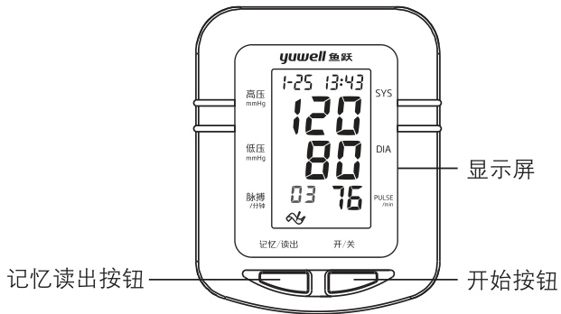

# 二、显示屏

日期 18-88 38:88 时间88.8 收缩压88.8 舒张压  
存储编号  
充气符号 88188 脉搏  
放气符号 心 A kPa 低电量符号  
记忆符号 kPa显示符号心跳符号

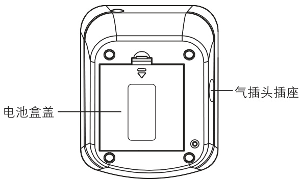

# 三、臂带

本臂带适用臂围范围为22厘米\~32厘米。

# 一、安装电池

打开位于血压计背面的电池盖，将四节5号电池装入电池盒中，安装时电池的正负极应与电池盒中正负极一致。

安装完电池后，将电池盒盖装上，此时应听到“咔嗒”一声。

$\blacktriangleright$ 在使用中，如果“”一直显示，表示电量不足。

在使用中，如果“”闪烁，表示电量已耗尽。请同时更换4节电池，不要将新旧电池混用，请使用寿命较长的碱性电池。

若长期（三个月以上）不使用血压计，请取出电池，避免电池漏液造成机器故障。废旧电池请妥善处置，以免污染环境。

个注意：本机可外接赠送的6V/600mA直流电源，(经过鱼跃验证的专用电源适配器)。长时间使用外接电源时请将电池取出。

电池正负极性与指示标示一致

将臂带上与橡胶导气管连接的气插头插入血压计左侧的插座中，如图所示。

打开电池盒盖

# 二、臂带的连接

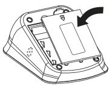  
关闭电池盒盖

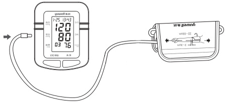

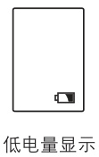

# 一、正确的测量姿势

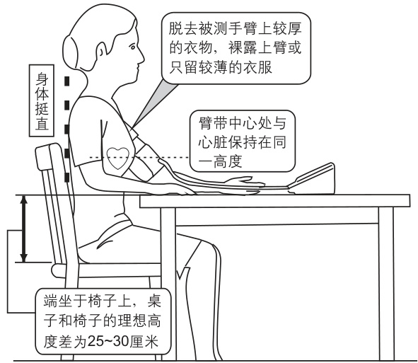

# 二、不正确的测量姿势

$\blacktriangleright$ 因桌子低矮或坐于沙发上，而造成弯腰、身体前倾。因此桌子和椅子的理想高度差为25厘米\~30厘米。必要时可在手臂下垫一个软垫。

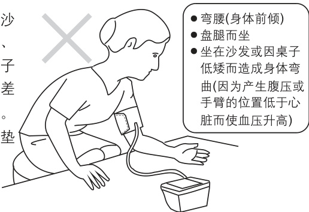

测量时盘腿而坐。

# 三、臂带的使用

# 友情提示！

左右手臂都可以进行测量。

将臂带平放于桌子上，使粘贴布朝下，并将臂带的末端穿过金属环，使其围成环状，此时臂带上的粘贴布方向朝外。

将臂带套在被测上臂，并使臂带气嘴指向下手臂，确保臂带的下边缘处于距离肘关节2厘米${ \sim } 3$ 厘米以上位置，并使气嘴位于胳膊内侧。  
拉紧臂带的自由边将粘贴布粘住。注意：臂带应当舒适地缠绕在上臂上，与手臂间没有间隙，防止过紧或过松。  
将下手臂平放在桌面上，掌心向上，身体坐直，并使臂带中心与心脏位置处于同一高度，同时请注意臂带上的橡胶导气管无扭曲或打折。

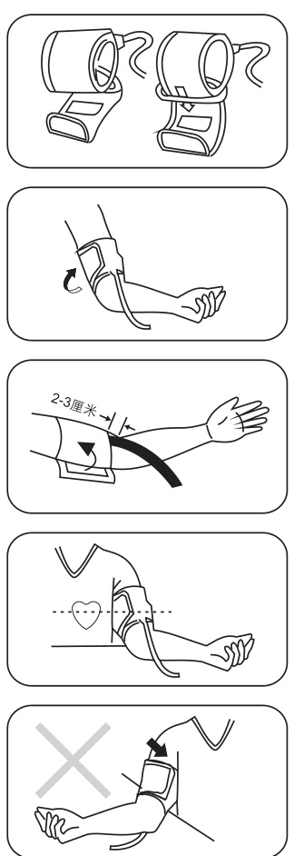

# 四、血压测量快速指南

为了便于获得精确的测量结果，在测量前半小时内，请不要进食、吸烟(喝酒)、沐浴以及任何形式大量消耗体力的劳动或运动。应尽量在每天的同一时间进行测量。

$\blacktriangleright$ 请确认臂带、橡胶导气管端、气接头连接紧密，气接头已牢固地插入机座左侧的插孔。  
$\blacktriangleright$ 脱去被测手臂上较厚的衣物，裸露上臂或只留较薄的衣服。  
$\blacktriangleright$ 挺直坐在椅子上，两脚平放于地面，将臂带缠绕于被测手臂的上臂，并将手臂放在桌面上，使臂带与心脏处于同一水平高度，测量前静坐5分钟\~10分钟。

$\blacktriangleright$ 按下[开/关]键后，屏幕会显示向下箭头符号“”，表示系统处于归零测试中。几秒后会显示向上箭头符号“公”，同时气泵开始充气。(若使用外接直流电源，则接通电源后，首先显示屏画面全部点亮，然后再按下[开/关]键，开始测量。)

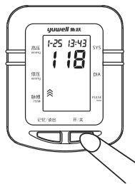  
按[开/关]键，开始充气  
充气状态

1-25_13:43 120 《

充气结束后血压计自动开始测量，显示屏上测量符号“”开始闪烁，泄气阀自动进行慢速排气，压力值不断下降。请在整个测量过程中保持情绪安静、稳定，不要讲话，不要移动身体和手。

测量结束后，测量符号“”停止闪烁，血压计将显示您的收缩压、舒张压以及心率，并自动快速排出臂带内残余空气。如需重复测量，则按下[开/关]键关机后，再次按下[开/关]键进行第二次测量。如果3分钟内没有新的按键动作，本机将自动关机，进入节电状态。

下图为测量结束时的屏幕显示画面：

1-25_13:43 108 测量状态

1-25 13:43 1-25 13:43  
1g 1452 577 77kPa  
毫米汞柱显示 千帕显示

# 友情提醒!

进行多次测量时，相邻两次测量的时间间隔至少为2分钟\~3分钟或更长的时间。

根据每次测量结果和血压分类表初步判断您的血压状况，并向您的医生咨询。

# 重要提示!

本产品能自动记录每次测量数据（包括时间、日期、血压值以及脉搏数)，最大记录数据次数为80次。需要查看历史记录时，只需按下[记忆/读出]键就可以翻看记录的数据。

# 五、测量中途紧急停止

在测量过程中，如果被测者感到不适，或者由于其它某些原因而需要中断测量时，请按下[开/关]键，本机将立即停止测量，并迅速排放臂带中的空气，以降低其中的气压。如果按[开/关]键失灵，请解开臂带，停正测量。

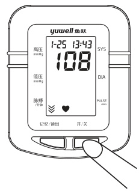  
按[开/关]键，立即停止测量

# 警告：

本产品充气上限290mmHg/38.7kPa，请不要让手臂长时间处于充气状态下，避免对手臂造成损伤。

# 一、时间及日期的设置

由于在同一天的不同时刻，人体血压是不同的。本血压计能自动记录每次测量的血压值和脉率，以利于血压管理。

本机安装好电池或重新通电后，需要重新设定时间和日期，设定方法按以下步骤进行。(如需设定的日期为2016-01-25时间13:43):

1、在关机状态下，同时按住[记忆/读出]和[开/关]键，并持续3秒以上，进入年份设置项，此时表示年份的后两个数字(前两个数字省略显示)开始闪动，如2016年显示16。(如图A)

同时按住[记忆/读出]和[开/关]键，并持续3秒以上

1-25 13:43年T6

X-25 13:43年16

12513:43 ￥ 15

1-25 13:43年16

1-25 13:43 ￥ 15

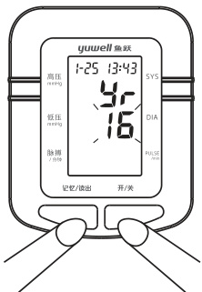  
图C  
图D  
图E

2、单次按下[记忆/读出]键设定年份，每按一次将变化一年。

3、设定好年份后按一下[开/关]键，切换至月份设置，表示月份的数字开始闪动，设置方法同2。(如图B)

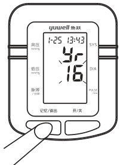  
图A  
当按住[记忆/读出]键不放时可实现快速设定

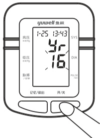  
图B  
按[开/关]键切换

4、月份设置好后按一下[开/关]键，切换至日期的设置，表示日期的数字开始闪动，设置方法同2。(如图C)  
5、日期设置好后按下[开/关]键，切换至时间设置，此时表示小时的数字开始闪动，设置方法同2。(如图D)  
6、小时设置好后按下[开/关]键，此时表示分钟的数字开始闪动，设置方法同2。(如图E)

# 二、语音功能设置

在日期和时间设置完毕后，再按下[开/关]键，进入语音功能设置模式，屏幕上出现当前语音音量值(范围为01-05)，此时按下[记忆/读出]键时，音量逐渐升高，数值依次增加，并同时以当前音量播报当前数值，当音量值达到最大音量05时再按下[记忆/读出]键，可关闭语音功能，用户可按[记忆/读出]键依次循环，如下图。确认好当前音量后按下[开/关]键结束设置状态。

# 三、mmHg/kPa显示切换设置

kPa显示格式 0.0 00 \$ ↓↑ □ 0   
mmHg显示格

在日期和时间设置完毕后，再按下[开/关]键，进入mmHg/kPa设置(机器默认为mmHg单位)，当屏幕上出现闪动的kPa，表示测量结果为kPa显示格式，此时按下[记忆/读出]键时，kPa符号消失，表示进入mmHg显示格式。当继续按下[记忆/读出]键时，又可进入kPa显示格式，如此反复，可在两种显示格式之间轮换设置，如图。选择好后按下[开/关]键结束设置状态。

# 四、使用记忆功能

本血压计能自动记录每次测量的血压值、脉搏数及时间日期等数据，以利于血压管理。

1、安装好电池后，按下[记忆/读出]键，显示所记录的最新测量结果。

A、第一次按下[记忆/读出]键，显示最近3次的平均值，此时编号栏无号码。

1-2513:43   
120   
89   
03 76

2

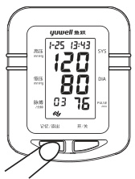  
按[记忆/读出]键   
平均值显示  
第3组记忆数据

B、再次按下[记忆/读出]键，显示第一组记忆值，记忆值编号将显示为 $\cdot 1 { \sim } 8 0 ^ { \mathfrak { n } }$ 。“1”为最新的测试结果，“80”为最旧的测试结果。

# 提示!

如果数据已存储满，则第80组数据将被第79组数据代替，第1组数据将被新的数据代替。

C、每按一次[记忆/读出]键：将按 $s \ 1 ^ { \mathfrak { P } } \ \to \ { } ^ { \mathfrak { c } } 2 ^ { \mathfrak { w } } \ \to \ \cdots { } \ \to$ “存储组数(最大为80）”的顺序显示，显示完最后一组数据后，将返回到第一组数据。  
D、按住[记忆/读出]按钮不放时，可以自动快速寻找测试数据。

2、删除记忆值。

在记忆值状态下，同时按下[记忆/读出]和[开/关]键不放，待出现一个CLr1后，放开双键，记忆清除成功。如下图示：

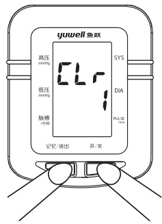

注意：本操作将删除全部记忆值。

# 五、静态模式进入

此项功能主要供专业人员(主要是计量局）进入电子血压计静态模式，并通过标准压力计来检验电子血压计静态。

个警告：普通使用者无需了解此项功能，也建议不要进行此项操作。由于此操作不当造成的不良后果，本公司不予负责。

# 1、系统自动归零

安装好电池后，按下[开/关]键后，屏幕会显示向下箭头符号“”，表示系统处于归零测试中。几秒后会显示向上箭头符号“公”，同时气泵开始充气。“”符号消失，即表示系统自动归零结束，此时可以按下[开/关]键停止充气，取出电池，进入下一步。

注意：在进入静态模式前务必进行系统自动归零操作，否则，直接进入静态模式会造成静态检验不准确。

# 2、进入静态模式

按住[记忆/读出]键不放开，同时安装电池，等待大约3秒，听到“咔”的声音，松开[记忆/读出]键，屏幕显示“”及日期和时间（日期、时间显示从上次设定值开始），此时系统指向零位，表示已进入静态模式，可以进行静态压力检验。

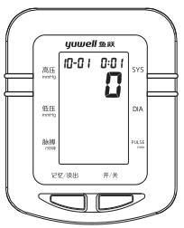

# 提示!

(1)进入静态模式后，如果屏幕不显示“日”，可按“系统自动归零”方法重新操作；若此方法无法排除，可联系本地经销商或直接拨打售后服务电话。

(2)在进入静态模式后，无操作，机器在4分钟后自动关机。如果要再次进入静态模式，请重复以上操作。

# 一、何谓血压?

$\blacktriangleright$ 血压是由大脑的循环中枢来调节的，经过神经系统的调节作用，身体能够自动适应或改变血压，从而使身体的不同部位在不同的状态下做出相应的反应，人体是通过毛细血管壁平滑肌的伸缩来改变血管管径和脉搏，进而改变血压的。  
▶当心脏收缩时，对外供血血压最高，此时该血压称为收缩压(高压)；当心脏舒张时，血液流回心脏，血压最低，此时该血压称为舒张压(低压)。

# 二、健康与血压

$\blacktriangleright$ 随着年龄的增长，人体内的血管便会日益老化，加上肥胖或者运动不足等原因，胆固醇粘贴在血管上，血管则逐步失去弹性，血压升高，所以人们到了老年时，高血压症状便会明显增多。这样高血压患者动脉硬化就会加速，很容易引起中风或心肌梗塞等危险疾病。这时，我们很有必要了解自己的血压是否处于健康的状态。但是由于在日常生活中血压是时刻变化着的，所以血压的测量就成为我们日常生活健康管理中不可缺乏的事件之一。

# 三、血压分类

世界卫生组织、国际高血压协会制定了如下血压分类表。

<html><body><table><tr><td>范围</td><td>收缩压(kPa/mmHg)</td><td>舒张压(kPa/mmHg)</td><td>相应措施</td></tr><tr><td>低血压</td><td>≤13.3/100</td><td>≤8.0/60</td><td>请医生检测</td></tr><tr><td>正常血压</td><td>13.3/100~18.7/140</td><td>8.0/60~12.0/90</td><td>自我检测</td></tr><tr><td>轻度高血压</td><td>18.7/140~21.3/160</td><td>12.0/90~13.3/100</td><td>咨询医生</td></tr><tr><td>中度高血压</td><td>21.3/160~24.0/180</td><td>13.3/100~14.7/110</td><td>咨询医生</td></tr><tr><td>严重高血压</td><td>≥24.0/180</td><td>≥14.7/110</td><td>危险！请尽 快看医生</td></tr></table></body></html>

个注意：对低血压还没有定义，一般来说高压值小于100mmHg称为低血压。

# 四、影响血压测量的因素?

对血压进行比较测量时，必须在相同的条件下进行！一般是指每天固定的时间段内在安静的环境下进行测量。  
如果用力支撑手臂、心理紧张或思想杂乱会引起血压的增加，所以在测量前请确保您处在舒适、放松的状态，并且在测量过程中不要活动被测手臂。(根据需要可在手臂下垫一个软垫)。  
被测点的位置应和心脏尽量在同一高度，如果过多地高于或低于心脏的位置，则将获得不正确的测量结果。  
臂带缠绕过于紧缩(或松垮)、气囊外露会引起测量偏差。  
$\blacktriangleright$ 重复测量会使血液积聚在手臂上，一方面会引起手臂麻木，另一方面也会导致错误的测量结果，所以相邻两次测量应间隔2分钟\~3分钟或更长时间。以下情况也有可能引起血压变化，导致与正常值产生差异：喝酒、红茶、咖啡后，吸烟后，沐浴后，服药一小时后，餐后一小时内，腹部受压的测量姿势。

# 五、为什么在家测得的血压值比在医院测得的血压值低？

▶在家测量的血压值有时会比在医院测得的血压值低20mmHg\~30$\mathsf { m m H g } ( 2 . 7 \mathsf { k P a } \mathord { \sim } 4 . 0 \mathsf { k P a } )$ 。这是因为在医院测量常会感到紧张，而在家里测量则情绪较稳定。因而，了解自己在家里安静时的常规血压值是很重要的。  
如果测量时臂带的位置高于心脏，则测得的血压值会偏低。请用正确的姿势测量。

# 六、为什么在家测得的血压值比在医院测得的血压值高？

服用降压药的人，在失去药效时测量值会偏高。

$\blacktriangleright$ 臂带缠绕位置不正确。捕捉不到血压脉冲信号，测出的血压值偏高。请确认正确缠绕臂带。  
$\blacktriangleright$ 臂带卷的太松。使其压迫力传送不到动脉，因此测得的血压值比实际值偏高。请卷紧臂带，手臂和臂带间应无间隙。  
$\blacktriangleright$ 测量姿势不正确。弯腰、盘腿而坐、坐在沙发或低矮的桌子上弯下身体测量等错误的测量姿势，或手臂的位置低于心脏而使测得的血压值偏高。请用正确的姿势测量。

# 七、为什么测量时会因臂带的紧缩而感到疼痛或麻木？

$\blacktriangleright$ 测量血压时需要将臂带紧缩至动脉的血液流动暂时停止，因此可能会暂时感到疼痛或麻木，但这对身体并无损害，请放心测量。

# 八、什么时候是测量血压的最佳时间？

$\blacktriangleright$ 早晨测量时请在起身排尿后、早餐前进行。  
$\blacktriangleright$ 晚上测量时建议在就寝前进行。  
$\blacktriangleright$ 如果正在服用降压药，请在服药前进行。  
$\blacktriangleright$ 其他时间测量时，请在身体和心情都处于安静稳定状态下进行测量。建议每天在同一时间测量。

# 九、为什么每次测得的血压值都不一样？

$\blacktriangleright$ 心脏每次收缩时血压都有所变化，如：脉搏为70次/分钟的人，每天大约会有100800次的血压变化。由于血压时刻变化，因此只测量一次难以得到正确的正常血压值。请连续测量 $2 { \sim } 3$ 次。

# $*$ 继续测量时请注意：

$\blacktriangleright$ 测量时由于手臂受压迫使手指端部血液流通不畅而引起淤血，如果在此时继续进行测量，则不能得到正确的血压值。此时应当松开臂带，把手举过头顶，反复进行十几次左右手掌的握紧和伸展运动。  
臂带位置、缠绕方法不同时，测量值也有所不同。特别是卷在肘部时，将不能得到正确的测量值。请用正确的缠绕臂带的方法测量。

# 十、在家中进行血压管理的重要性是什么？

▶ 坚持每天记录血压值，掌握自己的血压变化趋势，有助于健康管理，在接受医生的诊断时也很有帮助。为了正确诊断，请将测量条件(测量时间、降压药的服用、生活状态等）和血压数据一起做成表格记录下来。

下表为使用过程中可能出现的常见故障及其排除方法，若您在使用中出现与之相符合的状况，请参照处理。

<html><body><table><tr><td>常见故障</td><td>排除措施</td></tr><tr><td rowspan="2">本机装有电池，而按下 [开关]按钮后不工作</td><td>检查电池正负极性有无装反</td></tr><tr><td>请更换新电池</td></tr><tr><td rowspan="3">多次出现测量失败，或测 量值严重偏低(或偏高)</td><td>检查臂带连接及缠绕是否正确 检查臂带缠绕是否太紧或太松，检</td></tr><tr><td>查卷起的衣物是否太紧而压住了手 臂上的测量位置，如有请脱掉该衣 物重新测量</td></tr><tr><td>确认在安静、放松的状态下测量血 压。最好在测量前做几次深呼吸以 使自己放松下来</td></tr><tr><td>本机工作状态良好，但每 次测量结果都有差异</td><td>请仔细阅读《影响血压测量的因素》 中所列举的各项注意信息 注意：血压是动态的，因此每次 测量值之间必会存在一些差异</td></tr><tr><td>所测血压值与医生对自己 测得的值不同，甚至严重 偏小</td><td>记下您每天测量的血压值，并向医 生咨询 注意：频繁的咨询医生会引起 心理紧张，因而导致在医生面前测 得的血压值比在自己家中放松状态</td></tr><tr><td rowspan="2">气泵工作，但气压并 不上升</td><td>下测得的值偏高 检查臂带连接是否良好、有无漏气</td></tr><tr><td>若因年久而损坏，请购买新品</td></tr></table></body></html>

下表是在测量过程中可能会出现的错误显示符、可能原因及处理方法。请用正确的使用方法再次测量。

<html><body><table><tr><td>错误显示</td><td>故障原因</td><td>解决方法</td></tr><tr><td>Err4</td><td>无法检测出高低压</td><td>请系紧臂带后再测试</td></tr><tr><td>Err5</td><td>气泵加压错误</td><td>请检查臂带是否有漏气</td></tr><tr><td>Err6</td><td>手腕或身体运动引起 加压不当</td><td>手腕或身体保持不动， 并重新测试</td></tr><tr><td>Err7</td><td>臂带太松或松脱</td><td>请系紧臂带后再测试</td></tr><tr><td>Err8</td><td>压力超过最大测量值 290mmHg</td><td>请重新测量</td></tr><tr><td>欠压符号 “”出现</td><td>电池电量不足</td><td>请更换新电池</td></tr></table></body></html>

警告：若在使用中上述情况无法排除、或出现上述以外的故障，请向当地经销商咨询！

为了保护血压计免受损坏，以保证测量的准确性，请遵守以下事项：

！使用完毕或不使用时，请将血压计及附件整理好收藏，并妥善放置，防止其受到强烈撞击或震动。  
$\bigcirc$ 请勿将本机及附件暴露在高温、高湿、有灰尘、或者阳光直射的地方。  
$\textcircled{8}$ 因臂带内含一个气密性良好的气囊，请小心使用，不要折叠、拉扯、扭拧臂带。  
$\bullet$ 请小心使用橡胶导气管，不要用力拉扯、扭拧，不要跟有尖角的物体接触。  
$\bigcirc$ 请勿擅自拆卸、修理本血压计。  
$\bigcirc$ 请勿擅自更换部件。  
$\bigcirc$ 请勿用非厂家提供的臂带更换原有臂带，可能会引起测量错误!  
若血压计较脏，请用柔软的干布进行清洁，如果本机特别脏，则可用沾有水或中性洗涤剂的软布拧干后擦拭本机，然后用干的软布擦干。必要时，可用蘸有消毒酒精的脱脂棉轻轻擦拭，对本机进行消毒(面板、铭牌处除外)。切忌用洗衣粉或洗洁剂来清洗!+

$\bigcirc$ 请勿将本体内部渗入水或其它液体。

# 友情提醒!

建议对血压计进行校准(至少一年一次)，由国家计量检测部门、制造商或通过制造商授权的特约维修中心予以实施。

