MC（苏）制11000034号  
生产许可证号：苏食药监械生产许20010089号  
产品技术要求/注册证编号：苏械注准20162200402  
产品标准号：YY0670-2008

# yuwell鱼跃

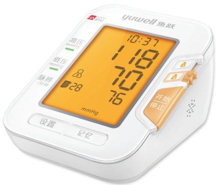

# 臂式电子血压计

Electronic Blood Pressure Monitor 规格型号：YE690C

# 产品使用及技术说明书

使用前请详细阅读说明书！生产日期见合格证或包装臂式电子血压计(以下简称血压计)

# 目录

# 产品使用前

产品特点 …01  
产品快速操作方法 . 02  
产品组成. ….05  
各组成部分名称… …06  
安全注意事项… … 08  
使用范围及注意事项… …15  
安装电池… …17  
时间及日期的设置… …18  
语音功能设置 …20  
mmHg/kPa单位显示设置. …21

# 测量方法

袖带使用方法 …22  
正确的测量姿势… ….24  
测量血压… …25  
血压范围警示… …29  
使用记忆功能… ……30  
正确测量辅助功能… …33  
当前时间大屏幕显示… …34  
静态模式进入… …35

# 常见问题及保修等

血压测量常见疑问与解答… …37  
常见故障及排除… …42  
保养与维护事项… ….4  
产品特点及技术参数… 45  
产品保证书… …47  
健康日记… …48

#

#

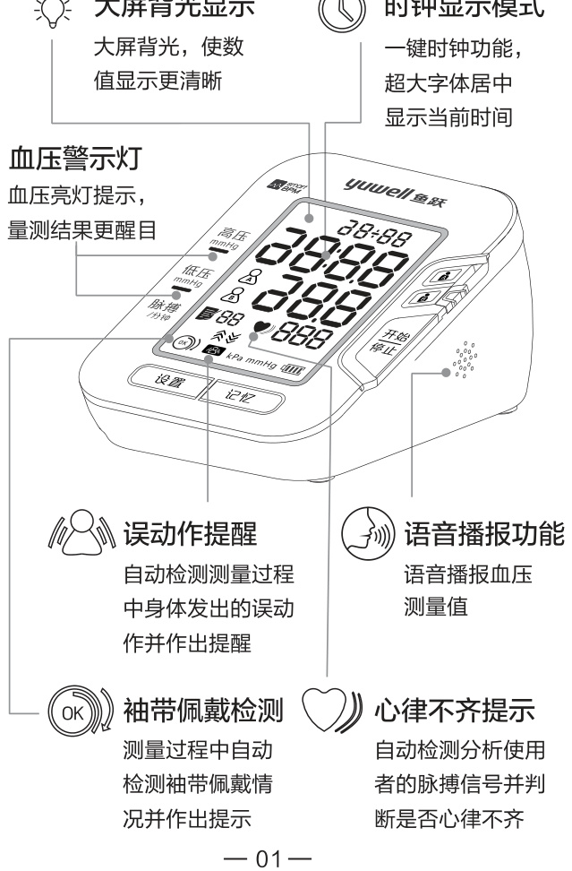

只有正确的测量方法，才能得到准确的数值请按以下的流程使用本机：

# 接通电源

插电源适配器

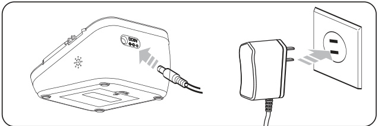

# 或装入4节碱性干电池

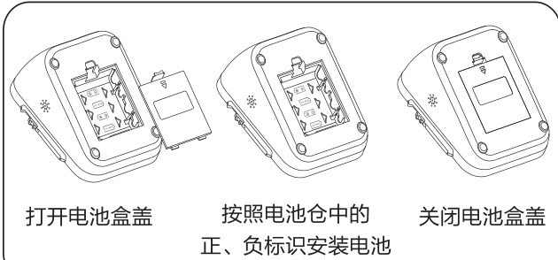

（详细介绍，参照第17页）

# 测量

# 1、随心测袖带使用方法

将袖带佩戴于被测手臂上，使袖带的下边缘距离肘关节2\~3厘米，袖带可绕上臂旋转在任意位置佩戴。(详细介绍，参照第23页)

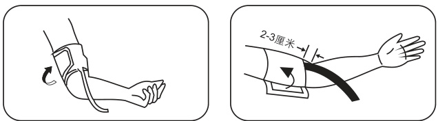

2、正确的测量姿势  
身体挺直，保持袖带中心处与心脏处于同一高  
度。(详细介绍，参照第24页)

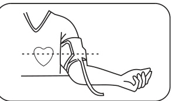

# 3、测量血压

开始测量前请静坐5分钟，按下 停止 键开始测量。(详细介绍，参照第25页)

# 查看血压测量记录

按下 记忆 键，查看血压测量记录本机可显示平均值以及80组x2人的测量结果。（详细介绍，参照第30页）

臂式电子血压计主要由外壳、开关、线路板、泵、电池、慢速限放装置、袖带(臂带）组成，外壳采用ABS塑料制成，袖带采用涂层布料制成。

# 一、本机主体

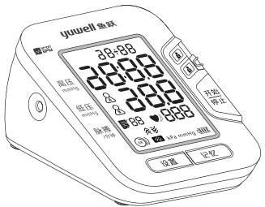

# 二、随心测袖带

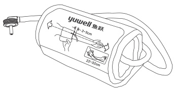

# 三、附件

使用说明书(附鱼跃产品保证书）、保修卡、合格证、4节5号碱性干电池（试用）

# 一、本机主体部分

yuwell鱼跃38÷88 显示屏高压 8888 用户切mmHg低压 8888 换开关开 开始/停止键88888kPa mmHg dI设置键 设置 记忆 记忆键

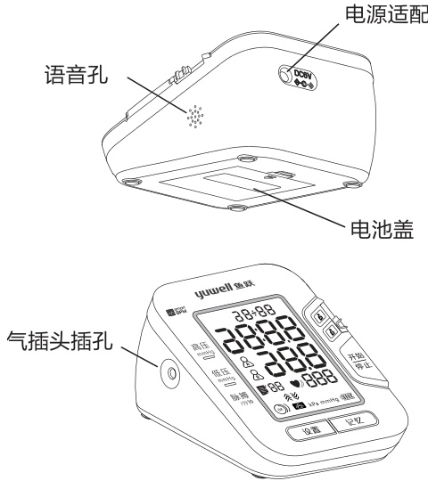

# 二、袖带

本袖带适用臂围范围为22厘米\~32厘米。

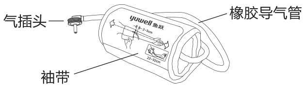

# 三、显示屏

时间、日期38÷88按设置 8888 高压当前时间用户图标 8888 低压记忆图标b88.v888 脉率记忆编号心跳、心律) kPa mmHg d充气、放气图标 不齐图标$0$ 心跳图标袖帯佩戴 误动作 电量图标 心律不齐图标自检图标提示图标压力单位

此处所示警告与注意，用于正确安全使用产品并防止对用户和他人造成危害或带来损害。

警告与注意内容如下：

LETLI   

<html><body><table><tr><td>图例</td><td>内容</td></tr><tr><td>警告</td><td>表示错误使用时，有可能发生人员伤亡</td></tr><tr><td>注意</td><td>表示错误使用时，有可能发生人员伤害或物品损坏</td></tr><tr><td></td><td>记号是表示禁止(不允许的事情) 具体禁止内容在中或者附近用文字或图画 表示，左图示表示“一般的禁止”</td></tr><tr><td>0</td><td>● 表示强制(必须遵守的事情) 具体强制内容在● 中或者附近用文字或图画 表示，左图示表示“一般的强制”</td></tr><tr><td>①</td><td>电子信息产品污染控制标志 本产品自使用之日起，环保使用期限为10年， 易耗品不包含在内。</td></tr><tr><td></td><td>符号含义是BF型应用部分</td></tr><tr><td>个</td><td>注意！查阅随机文件</td></tr><tr><td></td><td>向上</td></tr><tr><td></td><td>易碎物品</td></tr><tr><td></td><td>怕雨</td></tr></table></body></html>

<html><body><table><tr><td rowspan="2">部件名称</td><td colspan="6">有毒有害物质及其化合物或元素</td></tr><tr><td>铅及其</td><td>汞及其</td><td>镉及其</td><td>六价铬及其</td><td>多溴联苯 ≤1000PPM</td><td>多溴二苯醚 ≤1000PPM</td></tr><tr><td>塑料外壳</td><td>O</td><td>O</td><td>O</td><td>O</td><td>O</td><td>O</td></tr><tr><td>内部线缆</td><td></td><td>O</td><td>O</td><td>O</td><td>O</td><td>O</td></tr><tr><td>线路板(含LCD)</td><td>O</td><td>O</td><td>O</td><td>O</td><td>O</td><td>O</td></tr><tr><td>袖带</td><td>O</td><td>O</td><td>O</td><td>O</td><td>O</td><td>O</td></tr><tr><td>电源适配器*</td><td>O</td><td>O</td><td>O</td><td>O</td><td>O</td><td>O</td></tr><tr><td>电池*</td><td>O</td><td>O</td><td>O</td><td>O</td><td>O</td><td>O</td></tr><tr><td>包材</td><td>O</td><td>O</td><td>O</td><td>O</td><td>O</td><td>O</td></tr><tr><td colspan="7">：表示该有毒有害物质在该部件所有均质材料中的含量均在GB/T26572-2011标准规定的 限量要求以下。 ×：表示该有毒有害物质至少在该部件的某一均质材料中的含量超出GB/T26572-2011标准 规定的限量要求。 *：表示该部件可能不是产品组成部件，以说明书中包装清单为准。 注：钢材中含铅≤3500PPM，铝材中含铅≤4000PPM，铜材中含铅≤4%； 所有包装类六种有毒有害物质含量均≤100PPM。</td></tr></table></body></html>

# 电磁兼容说明

本产品符合安全使用医用电气设备要求的EMC(电磁兼容性）标准和YY0505-2012。EMC标准是为了安全使用医用电气设备而定制的标准，该标准规定应将设备产生的电磁波对其他设备的干扰、以及其他设备(手机等)发出的电磁波干扰控制在一定的范围内。YY0505-2012(5.2.1.1项)中规定了需要使用者提供设备安全运行的EMC环境相关的详细信息，下面是对EMC相关技术说明的描述。(详情请参照YY0505-2012)

本产品在此EMC技术资料中所定的电磁环境工作时，其适用范围所述基本性能不受其影响。

EMC(电磁兼容性）的定义

EMC(电磁兼容性）是指满足以下两方面要求的能力。

1、不会对附近的其他电子设备发出容许之外的电磁干扰声。(辐射)

2、设备在有其他电子设备发出噪声等的干扰的电磁环境中能正常发挥其功能。(抗扰度)

EMC（电磁兼容性）相关技术说明  
医用电气设备需要有关EMC的专门指示，应根据以下描述的EMC信息进行使用。

1、本产品需要有关电磁兼容性(EMC)的专门提示。请根据本手册描述的EMC信息进行使用。

2、便携式和无线射频(射频)通信设备可能影响本产品。

3、请勿将本产品与其他设备相邻或叠放使用。(通信时除外)

4、不可使用除专用附件以外的产品。否则可能导致辐射增加，抗扰度降低。

# 表1：准则及制造商声明-电磁发射一

<html><body><table><tr><td colspan="3">准则及制造商声明－电磁发射</td></tr><tr><td colspan="3">本产品及专用AC电源适配器应在以下规定的电磁环境中使用。</td></tr><tr><td>发射试验</td><td>符合性</td><td>电磁环境-指南</td></tr><tr><td>射频发射 GB 4824</td><td>1组</td><td>本产品及专用AC电源适配器仅其内部功 能使用射频能量。因此，该射频发射很 低，对周围的电子器械造成干扰的可能 性较小。</td></tr><tr><td>射频发射 GB 4824</td><td>B类</td><td rowspan="2">本产品及专用AC电源适配器适用于包括 下述设施在内的所有设施。是指直接连 接到为家庭用设施及用于家庭目的的建</td></tr><tr><td>谐波发射 GB 17625.1</td><td>A类</td></tr><tr><td>电压波动/闪烁发射 GB 17625.2</td><td>适用</td><td>筑物供应电力的公共低压电网的设施。</td></tr></table></body></html>

# 表2：准则及制造商声明一电磁抗扰度一

<html><body><table><tr><td colspan="4">准则及制造商声明- 电磁抗扰度</td></tr><tr><td colspan="4">本产品及专用AC电源适配器的购买者或使用者应在该环境下使用。</td></tr><tr><td>抗扰度试验</td><td>IEC60601 试验电平</td><td>符合电平</td><td>电磁环境-指南</td></tr><tr><td>静电放电 GB/T 17626.2</td><td>±6kV接触放电 ±8kV空气放电</td><td>±6kV接触放电 ±8kV空气放电</td><td>地面应是木制、混凝土或 瓷砖，如果地面用合成材 料覆盖，则相对湿度至少 为30%</td></tr><tr><td>电快速瞬变 脉冲群 GB/T 17626.4</td><td>±2kV对电源线 ±1kV对输入/ 输出线</td><td>±2kV对电源线 不适用</td><td>网电源应具有典型的商业 或医院环境中使用的质量</td></tr><tr><td>浪涌 GB/T 17626.5</td><td>±1 kV线对线 ±2 kV线对地 <5%Uτ，持续</td><td>± 1 kV线对线 不适用 <5%Uτ，持续</td><td>网电源应具有典型的商业 或医院环境中使用的质量</td></tr><tr><td>电源输入线上 电压暂降、 短时中断和 电压变动化 GB/T 17626.11</td><td>0.5周期(在U上 >95%的暂降) 40%U，持续 5周期(在Ur上， 60%的暂降) 70%Uτ，持续 25周期（在U上 30%的暂降) <5%Uτ，持续 5秒(在U上，</td><td>0.5周期（在U上， >95%的暂降) 40%Uτ，持续 5周期(在Uτ上， 60%的暂降) <5%U，持续 25周期(在U上， 30%的暂降) <5%Uτ，持续 5秒(在U上，</td><td>网电源应具有典型的商业 或医院环境中使用的质量。 如果本产品及专用AC电源 适配器的使用者在电源中 断期间需要连续运行，则 推荐使用电池</td></tr><tr><td>工频磁场 (50/60 Hz) GB/T 17626.8</td><td>>95%的暂降) 3A/m</td><td>>95%的暂降) 3A/m</td><td>工频磁场在典型的商业或 医院环境中应具有与一般 场所相同水平的特性</td></tr><tr><td colspan="2">备注：U- 指施加试验电压前的交流网电压，</td><td></td><td></td></tr></table></body></html>

# 表3：准则及制造商声明一电磁抗扰度一

<html><body><table><tr><td colspan="4">准则及制造商声明一电磁抗扰度</td></tr><tr><td colspan="4">本产品及专用AC电源适配器应在以下规定的电磁环境下使用。</td></tr><tr><td>抗扰度试验</td><td>IEC60601试验电平符合电平</td><td></td><td>电磁环境-指南 不应在利用通过与发射机频率</td></tr><tr><td>射频传导 GB/T 17626.6</td><td>3V(有效值) 150kHz~80MHz</td><td>3V(有效值）针本产品的所有部位。</td><td>相对应的方程式计算出的推荐 间隔距离以内使用便携式与移 动式RF通信设备，此间隔距离 推荐间隔距离 d=1.2√P d=1.2 √P 80 MHz ~ 800 MHz d=2.3 √P 800 MHz ~ 2.5 GHz 其中，P为发射机制造商所规定</td></tr><tr><td>射频辐射 GB/T 17626.3</td><td>3V/m 80MHz~2.5GHz</td><td>3V/m</td><td>的发射机最大额定输出功率， 以瓦特(W)为单位，d为推荐间 隔距离，以米(m)为单位。 固定式射频发射机的电场强度 通过对电磁场的现场勘查a)来 确定，在每个频段范围都应比 合规性等级低。 在标有下述记号的设备附近有 可能发生干扰。 ()))</td></tr><tr><td colspan="4">备注1：在8OMHz与80OMHz的环境下，间隔距离应用高频范围。 备注2：这些准则并非适用于所有状况。因为电磁波的传播还受建筑物、物体、 人体吸收与反射的影响。</td></tr><tr><td colspan="4">a)例如无线电话基站(手机/无线)、陆地移动无线电、业余无线电、AM/FM广 播、电视台之类的固定发射机产生的电场强度，就无法从理论上正确推算。 为了判断固定射频发射机产生的电磁环境，应考虑进行电磁场的现场勘测。在 使用本产品及专用AC电源适配器的场所测得的电场强度超过上述应用的射频 合规性等级时，应实行现场监控，以便验证本产品及专用AC电源适配器是否 正常工作。如有异常，应采取额外措施重新对本产品及专用AC电源适配器的 朝向或位置进行更改。 b)频率范围为在150kHz~80MHz，电磁强度为过3V/m以下。</td></tr></table></body></html>

# 表4：-便携式和移动式射频通信设备与设备过本产品之间的推荐间隔距离–

<html><body><table><tr><td colspan="4">便携式和移动式射频通信设备与设备或本产品及专用AC电源适配器之间的推 荐间隔距离。</td></tr><tr><td colspan="4">本产品及专用AC电源适配器应在对辐射射频干扰进行管理的电磁环境内使 用。本产品及专用AC电源适配器的购买者或使用者应根据通信设备的最大输 出功率，保持以下推荐的便携式和移动式射频通信设备(发射机)与本产品及专 用AC电源适配器之间的最小距离，以抑制电磁干扰。</td></tr><tr><td rowspan="2">发射机的最大额定 输出功率(W)</td><td colspan="3">基于发射机频率的 间隔距离(m)</td></tr><tr><td>d=1.2√P</td><td>150kHz~80MHz|80MHz~800MHz 800MHz~2.5GHz d=1.2√P</td><td>d=2.3√P</td></tr><tr><td>0.01</td><td>0.12</td><td>0.12</td><td>0.23</td></tr><tr><td>0.1</td><td>0.38</td><td>0.38</td><td>0.73</td></tr><tr><td>1</td><td>1.2</td><td>1.2</td><td>2.3</td></tr><tr><td>10</td><td>3.8</td><td>3.8</td><td>7.3</td></tr><tr><td>100</td><td>12</td><td>12</td><td>23</td></tr><tr><td colspan="4">关于最大额定输出功率不在上述列表内的发射机，用米(m)表示的推荐间隔距 离d可通过与发射机频率相对应的方程式计算出来。方程式中，P为用发射机 制造商所规定瓦数(W)表示的最大额定输出功率。 备注1：在80MHz与800MHz的环境下，间隔距离应用高频带宽度范围。 备注2：这些准则并非适用于所有状况。因为电磁辐射还受建筑物、物体、人 体吸收与反射的影响。</td></tr></table></body></html>

# 一、使用范围

本产品供测量人体血压和脉搏用(12周岁以上的成人，不适用于新生儿)!  
禁忌症：无

# 二、使用注意事项

个注意：测量血压时请务必注意以下几点，否则将可能造成血压测量值不准确！

测量前请静坐5分钟，再采用正确姿势进行测量（以保证情绪安静、稳定）。

$\bigcirc$ 请不要在站立、走动、身体部位受压时进行测量。

$\bigcirc$ 请不要在吸烟、喝酒、喝咖啡(红茶）后进行测量。

$\bigcirc$ 请不要在运动后、沐浴后进行测量。

$\bigcirc$ 请不要在测量过程中说话、移动身体。

$\bigcirc$ 请不要在测量过程中移动、抖动手臂或弯曲手指。

$\bigcirc$ 请不要在过冷、过热或条件变化剧烈的环境进行测量。

$\bigcirc$ 请不要在移动的交通工具中进行测量。

# 使用范围及注意事项

$\bigcirc$ 请不要长时间连续进行测量(相邻两次测量间隔2\~3分钟或更长时间)。

$\bigcirc$ 请不要在饭后1小时内进行测量。  
$\bigcirc$ 请不要在本产品附近使用手提电话。

！使用中若因误动作而无法正常测量，请重新安装电池进行测量。

！对于心律失常(如房早、室早及房颤）的患者测量结果可能不准确。

$\bigcirc$ 请不要让臂带处于长期充气状态。

●对废弃物的处理，应按城市有关环境保护的规定进行处理。

$\blacktriangleright$ 本产品自使用之日起，安全使用期限5年。

注意：对于测量出的结果请不要完全依靠自己的判断，务必接受医生的指导。

声明：如果在制造商指定的温度和湿度范围外储存或使用，系统可能无法达到声称的性能规格。

打开位于本机背面的电池盖，将4节5号电池装入电池盒中，安装时电池的正负极应与电池仓中正负极标识一致。安装完电池后，将电池盒盖装上，此时应听到“咔嗒”一声。

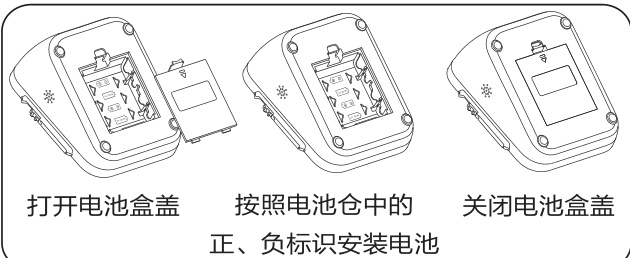

在使用中，如果出现“”，表示电池电量已不足。

在使用中，如果出现“”，且电池框闪烁表示电池电量已耗尽，请同时更换4节电池。不要将新旧电池混用，请使用寿命较长的碱性电池。

若长期(三个月以上)不使用本机，请取出电池。

个注意：本机可外接赠送的6V/600mA直流电源(经过鱼跃验证的专用电源适配器)。

由于在同一天的不同时刻，人体血压是不同的。本机能自动记录每次测量的血压值和脉率，以利于血压管理。

本机安装好电池或重新通电后，需要重新设定时间和日期，设定方法按以下步骤进行(如需设定的日期为2017-1-15，时间为上午08:28)：

1、按住 设置 键3秒以上，进入年份设置，此时表示年份的两个数字开始闪动。

2、每按一次“ 记忆 键，年份将增加一年。

3、设定好年份后按一下“ 设置 键，切换至月份设置，表示月份的数字开始闪烁。

4、按照同样的方式，按顺序设置月、日、小时、分钟。

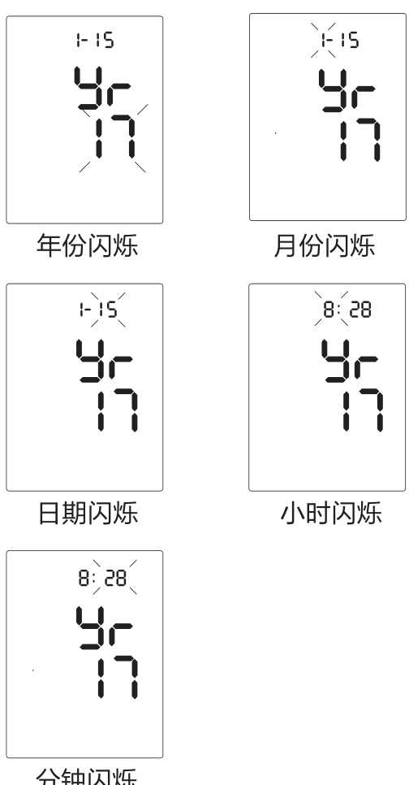

在日期和时间设置完成后，再按下 “ 设置 "键，进入语音功能设置模式，屏幕上出现当前语量值(01、02、03、04、05、OF)。01为最小音量，05为最大音量，OF为关闭语音功能。此时每按一下“ 记忆” 键，音量按01-…—05-OF的顺序循环切换。

在语音功能设置完毕后，按下“ 设置 ”键，进入压力单位设置(机器默认为mmHg单位)，当屏幕上出现闪动的mmHg，表示压力单位为mmHg，按下 记忆 键，则切换成kPa。按动 - 记忆 键，可在两种压力单位之间切换，如下图所示。

选择单位后按下 设置 键完成设定。

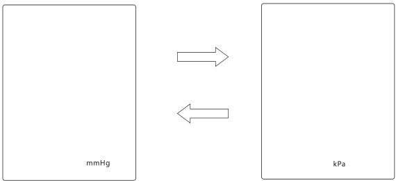

压力单位设置完成，按下 2 开始 ”' 键，可关停止  
闭本机。

# 友情提示!

左右手臂都可以进行测量。

# 袖带的连接

将袖带上的气插头插入本机左侧的气插头插孔中，如下图所示：

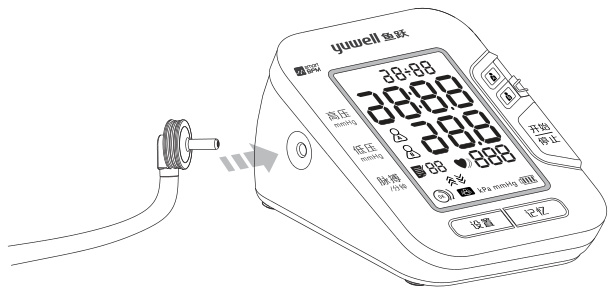

# 袖带的使用

将袖带套在被测上臂，根据袖带上的图标指示

正确佩戴袖带，使袖带气嘴指向下手臂，确保袖带的下边缘距离肘关节2\~3厘米，袖带可绕上臂旋转在任意位置佩戴。

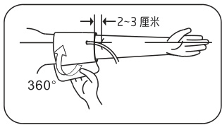

将下手臂平放在桌面上，掌心向上，身体坐直，并使袖带中心与心脏位置处于同一高度。

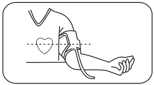

请勿将袖带上的橡胶导气管扭曲、打折或被手臂压住。

# 不正确的测量姿势

●弯腰(身体前倾)  
⚫盘腿而坐  
●坐在沙发或因桌子低矮而造成身体弯曲(因为产生腹压或手臂的位置低于心脏而使血压升高）

因桌子低矮或坐于沙发上，而造成弯腰、身体前倾。因此桌子和椅子的理想高度差为25\~30厘米。必要时可在手臂下垫一个软垫。

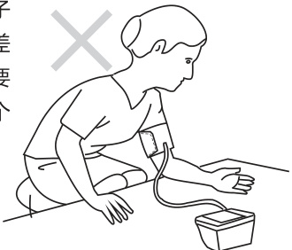

测量时盘腿而坐。

为了便于获得精确的测量结果，在测量前半小时内，请不要进食、吸烟、喝酒、沐浴以及任何形式大量消耗体力的劳动或运动。应尽量在每天的同一时间进行测量。

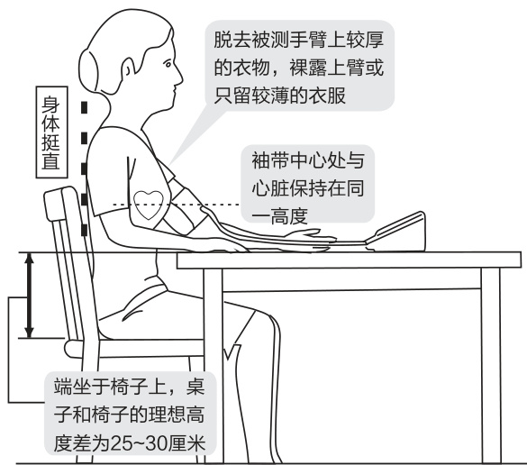  
全显状态

# 测量前请静坐5分钟

# 1、选择用户

拨动“”开关，选择用户A或用户B。如右图所示：

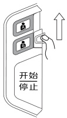

# 2、测量血压

按下“ 开始 7 键后，首先显停止  
示屏画面会全显1秒钟，待全显消失后，显示屏上放气图标“”开始闪烁，表示系统处于归零测试中。几秒后显示屏上显示充气图标“六”，表示系统自动归零结束，同时气泵开始充气。yuwell鱼跃38÷88  
高压 8888  
mmHg  
低压 888开始88888 停止  
脉搏  
/分钟kPa mmHg dE设置 记忆

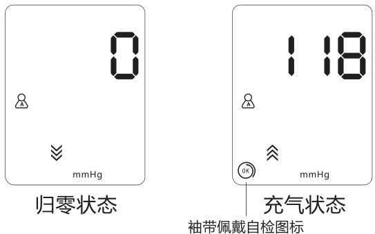  
测量状态

$\blacktriangleright$ 充气结束后本机自动开始测量，显示屏上“图标开始闪烁，泄气阀自动进行慢速排气，压力值不断下降。请在整个测量过程中保持情绪安静、稳定，不要讲话，不要移动身体和手。

:18 8 mmHg

# 测量中途紧急停止

在测量过程中，如果被测者感到不适，或者由于其它某些原因而需要中断测量时，请按下“ ”键，本机将立即停止测量，并迅速排放袖带中的空气，以降低其中的气压。如果按“ 开始 停止 ”键失灵，请解开袖带，停止测量。

yuwell 鱼跃   
PM 38÷88   
高压 8888   
mmHg   
低压 088 开始   
脉搏 88888 /f)钟 会 B kPa mmHg cI 设置 记忆

个警告：本产品充气上限290mmHg/38.7kPa，请不要让手臂长时间处于承受高压状态，避免对手臂造成损伤。

# 3、测量结束显示测量结果

测量结束后，本机将显示您的高压、低压以及脉率，并自动快速排出袖带内残余空气。

2:06 2:06115 58 市 8 0：73 73? mmHg ? kPa毫米汞柱显示 千帕显示

# 4、取下袖带

# 5、关机

开始按下“ 停止 键，关闭本机。即使忘记关机，本机3分钟内也会自动关机。

当 您 的 高 压 高 于 140mmHg或 低 压 高 于90mmHg时，您的血压偏高，请咨询医生。显示屏数字可以直观的说明您测试血压的情况。

# 血压警示灯

当血压测量数值正常时显示绿灯。  
当血压测量数值超出正常测量范围显示黄灯。

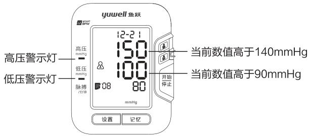

# 友情提示!

进行多次测量时，相邻两次测量的时间间隔至少为2\~3分钟或更长的时间。  
根据每次测量结果和血压分类表初步判断您的血压状况，并向您的医生咨询。

# 重要提示!

本产品能自动记录每次测量数据(包括时间、日期、血压值以及脉率），最大记录数据次数为80次/用户，需要查看历史记录时，只需按下“ 记忆 " 键就可以翻看记录的数据。

1、按下 记忆 键，进入测量值查看模式：

A、第一次按下 记忆 键，显示最近3次的平均值。B、再次按下 记忆 键，显示第一组记忆值，记忆值编号将显示为“ ${ \boldsymbol { 1 } } { \sim } { 8 0 } ^ { \mathfrak { N } }$ 。“1”为最新的测试结果，“80”为最旧的测试结果。

--158 1āB-- 78mmHg

2:23年  
8 80  
b01 82mmHg

# 提示

如果数据已存储满，则第80组数据将被第79组数据代替，第1组数据将被新的数据代替。C、每按次“记忆”键：将按“ $1 ^ { " }  { ^ { 6 6 } 2 ^ { " } }$ →……→“存储组数(最大为80)”的顺序递增显示。  
按住 记忆 键不放，可以自动快速寻找测量数据。  
D、按下“ 开址 ”5 键，关闭本机。

# 2、删除记忆值

删除用户A记忆值在查看记忆状态下，拨动“”开关，使当前用户为“A”，同时按下 记忆 键和 设置键不放，待出现下图画面后，放开双键，用户A的记忆清除成功，如右图所示：

Cir 8 ！ V

# 删除用户B记忆值

在查看记忆状态下，拨动“”开关，使当前用户为“B”，操作方法同上，用户B记忆值删除，如下图所示：

Cir8 --

删除记忆值后，按下 “ 开始 键，关闭本机。停止

# 袖带佩戴自检

袖带缠绕正确时显示“ )”图标。袖带缠  
绕过松时显示 “》”。如果显示  
请按 “ 开始 键停止测量，重新正确佩戴停止  
袖带，再进行测量。

# 误动作提示

测量过程中身体移动，可能出现 “ /81 ” 图标，表示可能导致不正确的测量结果，请重新测量一次。

注意：本操作将删除当前用户的全部记忆值。

# 当前时间大屏幕显示

按一下 设置 键，显示屏将醒目的显示当前时间，如下图示：

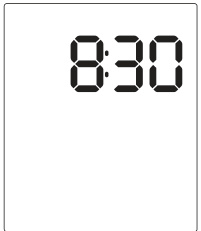

再按一下 设置 键则显示当前的日期、时间及压力单位等信息，如下图示：

12-21 830 8 mmHg

按下 “ 开好始 键，关闭本机。

此项功能主要供专业人员进入本机静态模式，并通过标准压力计来检验本机静态。

警告：普通使用者无需了解此项功能，也建议不要进行此项操作。由于此操作不当造成的不良后果，本公司不予负责。

# 系统自动归零

安装好电池后，按下“ 停止 开始 ”键，屏幕全显后显示放气图标“”，表示系统处于归零测试中。几秒后放气图标“”消失，同时气泵开始充气，即表示系统自动归零结束，此时可以按下 “ 开始 键停止充气，取出电池，进入下停止  
一步。

注意：在进入静态模式前务必进行系统自动归零操作，否则，直接进入静态模式会造成静态检验不准确。

# 进入静态模式

按住“[ 记忆 " 键不放开，同时安装电池，等待大约3秒，松开“ 记忆 “键，屏幕显示压力值“”及日期和时间(日期、时间显示从上次设定值开始)，此时系统指向零位，表示已进入静态模式，可以进行静态压力检验。

# 提示

▶进入静态模式后，如果屏幕压力值不显示“”，可按“系统自动归零”方法重新操作；若此方法无法排除，可联系本地经销商或直接拨打售后服务电话。

在进入静态模式后，无操作，机器在4分钟后自动关机。如果要再次进入静态模式，请重复以上操作。

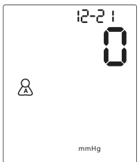  
静态模式

# 一、何谓血压？

血压是由大脑的循环中枢来调节的，经过神经系统的调节作用，身体能够自动适应或改变血压，从而使身体的不同部位在不同的状态下做出相应的反应，人体是通过毛细血管壁平滑肌的伸缩来改变血管管径和脉搏，进而改变血压的。

当心脏收缩时，对外供血血压最高，此时该血压称为收缩压(高压)；当心脏舒张时，血液流回心脏，血压最低，此时该血压称为舒张压(低压)。

# 二、健康与血压

随着年龄的增长，人体内的血管便会日益老化，加上肥胖或者运动不足等原因，胆固醇粘贴在血管上，血管则逐步失去弹性，血压升高，所以人们到了老年时，高血压症状便会明显增多。这样高血压患者动脉硬化就会加速，很容易引起中风或心肌梗塞等危险疾病。这时，我们很有必要了解自己的血压是否处于健康的状态。但是由于在日常生活中血压是时刻变化着的，所以血压的测量就成为我们日常生活健康管理中不可缺乏的事件之一。

# 三、血压分类

世界卫生组织、国际高血压协会制定了如下血压分类表。

<html><body><table><tr><td>范围</td><td>收缩压(高压) kPa/mmHg</td><td>舒张压(低压) kPa/mmHg</td><td>相应措施</td></tr><tr><td>低血压</td><td>≤13.3/100</td><td>≤8.0/60</td><td>请医生检测</td></tr><tr><td>正常血压</td><td>13.3/100~18.7/140</td><td>8.0/60~12.0/90</td><td>自我检测</td></tr><tr><td>轻度高血压</td><td>18.7/140~21.3/160</td><td>12.0/90~13.3/100</td><td>咨询医生</td></tr><tr><td>中度高血压</td><td>21.3/160~24.0/180</td><td>13.3/100~14.7/110</td><td>咨询医生</td></tr><tr><td>严重高血压</td><td>≥24.0/180</td><td>≥14.7/110</td><td>危险！请尽 快看医生</td></tr></table></body></html>

注意：对低血压还没有定义，一般来说高压值小于100mmHg称为低血压。

# 四、影响血压测量的因素?

$\blacktriangleright$ 对血压进行比较测量时，必须在相同的条件下进行！一般是指每天固定的时间段内在安静的环境下进行测量。  
如果用力支撑手臂、心理紧张或思想杂乱会引起血压的增加，所以在测量前请确保您处在舒适、放松的状态，并且在测量过程中不要活动被测手臂。  
被测点的位置应和心脏尽量在同一高度，如果过多地高于或低于心脏的位置，则将获得不正确的测量结果。

$\blacktriangleright$ 重复测量会使血液积聚在手臂上，一方面会引起手臂麻木，另一方面也会导致错误的测量结果，所以相邻两次测量应间隔2\~3min(分钟）或更长时间。

▶以下情况也有可能引起血压变化，导致与正常值产生差异：喝酒、红茶、咖啡后，吸烟后，沐浴后，服药1h(小时)后，餐后1h(小时)内，腹部受压的测量姿势。

# 五、为什么在家测得的血压值比在医院测得的血压值低?

在家测量的血压值有时会比在医院测得的血压值低20mmHg\~30mmHg(2.7kPa\~4.0kPa)。这是因为在医院测量常会感到紧张，而在家里测量则情绪较稳定。因而，了解自己在家里安静时的常规血压值是很重要的。

▶ 如果测量时袖带的位置高于心脏，则测得的血压值会偏低。请用正确的姿势测量。

六、为什么在家测得的血压值比在医院测得的血压值高?

服用降压药的人，在失去药效时测量值会偏高。

手臂放置位置不正确。捕捉不到血压脉冲信号，测出的血压值偏高。请确认手臂放置位置是否正确。

测量姿势不正确。弯腰、盘腿而坐、坐在沙发或低矮的桌子上弯下身体测量等错误的测量姿势，或手臂的位置低于心脏而使测得的血压值偏高。

请用正确的姿势测量。

# 七、为什么测量时会因臂带的紧缩而感到疼痛或麻木?

▶ 测量血压时需要将袖带紧缩至动脉的血液流动暂时停止，因此可能会暂时感到疼痛或麻木，但这对身体并无损害，请放心测量。

# 八、什么时候是测量血压的最佳时间？

早晨测量时请在起身排尿后、早餐前进行。  
▶晚上测量时建议在就寝前进行。  
$\blacktriangleright$ 如果正在服用降压药，请在服药前进行。  
$\blacktriangleright$ 其他时间测量时，请在身体和心情都处于安静稳定状态下进行测量。建议每天在同一时间测量。

# 九、为什么每次测得的血压值都不一样？

▶心脏每次收缩时血压都有所变化，如：脉率为70次/min(分钟)的人，每天大约会有100800次的血压变化。由于血压时刻变化，因此测量一次难以得到正确的血压值，请连续测量2\~3次。

# \*继续测量时请注意:

测量时由于手臂受压迫使手指端部血液流通不畅而引起淤血，如果在此时继续进行测量，则不能得到正确的血压值。此时应当松开袖带，举过头顶，反复进行十几次左右手掌的握紧和伸展运动。

袖带位置、缠绕方式不同时，测量值也有所不同。特别是卷在肘部时，将不能得到正确的测量值。

请用正确的测量姿势及方法测量。

# 十、在家中进行血压管理的重要性是什么？

坚持每天记录血压值，掌握自己的血压变化趋势，有助于健康管理，在接受医生的诊断时也很有帮助。为了正确诊断，请将测量条件(测量时间、降压药的服用、生活状态等）和血压数据一起做成表格记录下来。

下表为使用过程中可能出现的常见故障及其排除方法，若您在使用中出现与之相符合的状况，请参照处理。

<html><body><table><tr><td>常见故障</td><td>排除措施</td></tr><tr><td>本机装有电池，而按下 [开始/停止]按钮后不工作</td><td>检查电池正负极性有无装反</td></tr><tr><td rowspan="3">多次出现测量失败，或测 量值严重偏低(或偏高)</td><td>请更换新电池 检查袖带连接及缠绕是否正确</td></tr><tr><td>检查袖带缠绕是否太紧或太松，检 查卷起的衣物是否太紧而压住了手 臂上的测量位置，如有请脱掉该衣</td></tr><tr><td>物重新测量 确认在安静、放松的状态下测量血 压。最好在测量前做几次深呼吸以</td></tr><tr><td>本机工作状态良好，但每 次测量结果都有差异</td><td>使自己放松下来 请仔细阅读《影响血压测量的因素》 中所列举的各项注意信息 个注意：血压是动态的，因此每次 测量值之间必会存在一些差异</td></tr><tr><td>所测血压值与医生对自己 测得的值不同，甚至严重 偏小</td><td>记下您每天测量的血压值，并向医生 咨询 理紧张，因而导致在医生面前测得的 血压值比在自己家中放松状态下测得 注意：频繁的咨询医生会引起心</td></tr><tr><td rowspan="2">气泵工作，但气压并 不上升</td><td>的值偏高 检查袖带连接是否良好、有无漏气</td></tr><tr><td>若因年久而损坏，请购买新品</td></tr></table></body></html>

下表是在测量过程中可能会出现的错误显示符、可能原因及处理方法。请用正确的使用方法再次测量。

<html><body><table><tr><td>错误显示</td><td>故障原因</td><td>解决方法</td></tr><tr><td>Err4</td><td>无法检测出高低压</td><td>请系紧袖带后再测量</td></tr><tr><td>Err5</td><td>加压错误</td><td>请检查袖带是否有漏气</td></tr><tr><td>Err6</td><td>或体运动引起</td><td>管或身体保持不动，</td></tr><tr><td>Err7</td><td>袖带太松或松脱</td><td>请系紧袖带后再测量</td></tr><tr><td>Err8</td><td>力超过最大测量值</td><td>请重新测量</td></tr><tr><td>出现低电压 图标“□”</td><td>电池电量不足</td><td>请准备更换新电池</td></tr><tr><td>出现电池框 闪烁“”</td><td>电量耗尽</td><td>请更换新电池</td></tr></table></body></html>

、警告：若在使用中上述情况无法排除、或出现上述以外的故障，请向当地经销商咨询！

为了保护血压计免受损坏，以保证测量的准确性，请遵守以下事项：

！使用完毕或不使用时，请将本机及附件整理好收藏，并妥善放置，防止其受到强烈撞击或震动。  
$\bigcirc$ 请勿将本机及附件暴露在高温、高湿、有灰尘、或者阳光直射的地方。

！因袖带内含一个气密性良好的气囊，请小心使用，不要折叠、拉扯、扭拧气囊。

$\bigcirc$ 请勿擅自拆卸、修理本机。

$\bigcirc$ 请勿擅自更换部件。

若本机较脏，请用柔软的干布进行清洁，如果本机特别脏，则可用沾有水或中性洗涤剂的软布拧干后擦拭本机，然后用干的软布擦干。必要时，可用蘸有消毒酒精的脱脂棉轻轻擦拭，对本机进行消毒（面板、铭牌处除外）。切忌用洗衣粉或洗洁剂来清洗！

$\bigcirc$ 请勿将本体内部渗入水或其它液体。

# 友情提醒！

建议对本机进行校准(至少一年一次），由国家计量检测部门、制造商或通过制造商授权的特约维修中心予以实施。

# 一、产品特点

●大屏背光显示 ●语音播报●心律不齐检测 袖带佩戴检测●360随心测袖带 ●误动作提示检测●双用户，各80组记忆 ●三次平均值显示

# 二、技术参数

显示方式：LCD数字显示测量方法：示波测定法

测量范围：  
压力测量范围：0\~280mmHg(0\~37.3kPa)  
脉率：40\~200次/分  
精度：  
压力： $\pm 3 \mathsf { m m H g } ( \pm 0 . 4 \mathsf { k P a } ) \mathsf { l }$ 以内  
脉率：读数的 $\pm 5 \%$ 以内

运行模式分类：间歇运行电气安全分类：BF型应用部分设备类型：内部电源供电设备、非APIAPG设备（不能在有与空气混合的易燃麻醉气或与氧或氧化亚氮混合的易燃麻醉气情况下使用的设备）

进液防护程度：IPXO压力传感器：半导体式压力传感器加压方式：压力泵自动加压排气方式：自动快速排气电源：4节5号干电池 (DC 6V)或 6V/600mA直流电源电池寿命：4节5号高性能碱性干电池能测量约3 0 0 次[在室温 $2 3 ^ { \circ } \mathsf { C }$ ，每次加压至190mmHg(25.3kPa)的条件下]因附带的干电池只作试用，故可能用不到300次。

适合臂围： $2 2 { \sim } 3 2 ~ \mathsf { c m } ($ 厘米）

外形尺寸：约长 $1 4 5 \times$ 宽1 $1 5 \times$ 高75(毫米)

声明：本设备所测量的血压值和听诊法的测量值等价，其误差符合YY0667-2008规定的要求。相关说明信息请拨打客户服务热线咨询。

# 三、使用及存储条件

工作温湿度： $+ 5 \mathrm { { ^ circ C } } \sim + 4 0 \mathrm { { ^ \circ C } }$ $1 5 \% \mathsf { R H } \sim 8 0 \% \mathsf { R H }$   
工作大气压力： $8 0 \mathsf { k P a } \mathsf { \sim } 1 0 5 \mathsf { k P a }$   
运输、保存温湿度： $- 2 0 \mathrm { ^ c } \mathrm { \sim } + 5 5 \mathrm { ^ c }$ $1 5 \% \mathsf { R H } \sim 8 0 \% \mathsf { R H }$ ，且无冷凝现象  
运输、保存大气压力： $8 0 \mathsf { k P a } \sim 1 0 5 \mathsf { k P a }$

工作环境：避开电磁干扰、震动及噪音环境$\blacktriangleright$ 本产品自售出之日起，一星期内出现非人为因素的质量问题，本公司负责包退、包换、保修；在正常使用和保管情况下，本产品三年内出现质量问题，用户凭购物发票和保修卡给予免费维修，易耗易损件(包括气囊、气管、气接头、按钮、面板、电池)除外。三年以外的修理服务，将合理收费。

对下列因使用者个人原因而造成的故障或损坏将不提供免费维修服务：

1、擅自拆装、修理、改装本产品而造成的故障。

2、不正确的操作使用而造成的故障。

3、因不慎跌落而造成的损坏。

4、因不合理的保养而造成的故障。

5、因电池的泄漏而造成的腐蚀损坏。

6、因非鱼跃授权的维修点的不当修理而造成的故障等。

$\blacktriangleright$ 在进行保修服务时，如需要提供电路图、所必须的材料及电气线路的检修有疑难问题，请与制造商联系。

对本产品保留技术变更权利，如有变更恕不另行通知，敬请见谅！

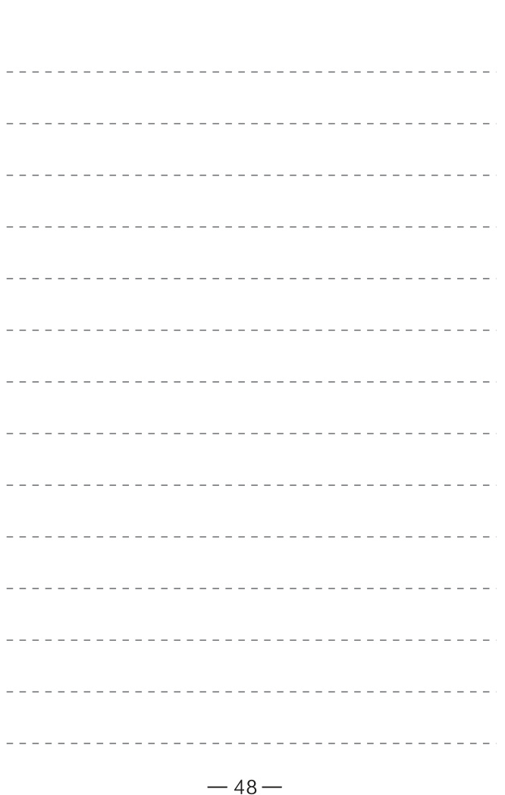

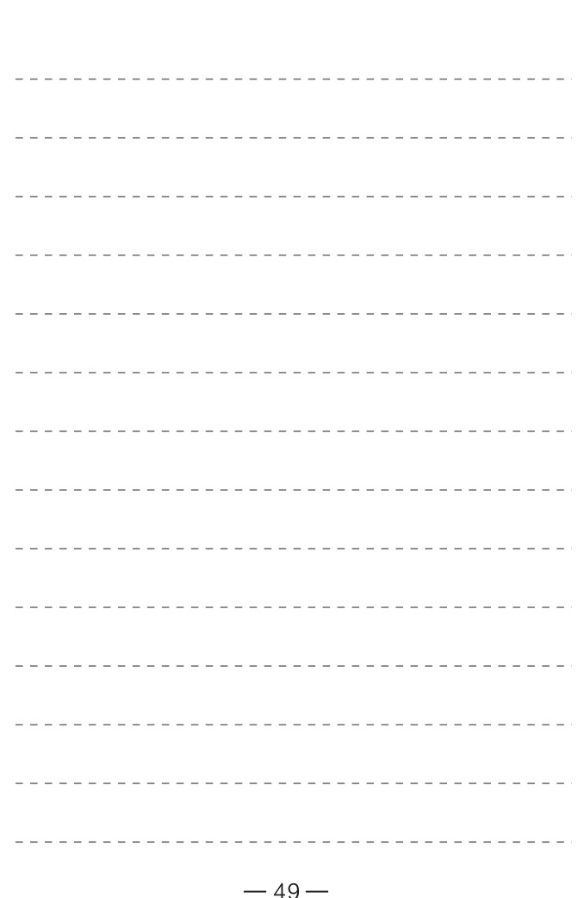